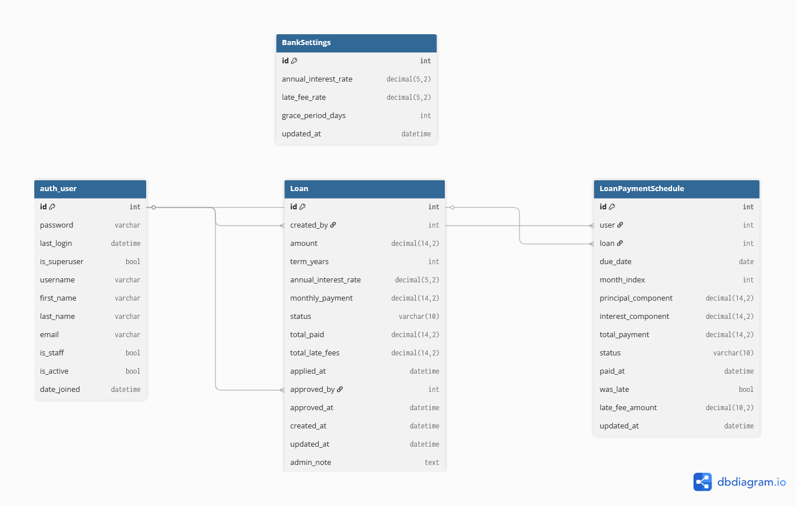

# 💰 Finverse — Simplified Banking and Loan Management System

**Finverse** is a full-stack Django REST application that simulates a simplified banking platform.  
It allows customers to create and apply for loans, view amortization schedules, and lets admins approve or reject applications.  
The system automatically tracks monthly payments and applies late-payment fees using a scheduled cron job.

## 🚀 Features

### 👤 **User Management**
- Customers can register and log in securely (Django REST Framework).
- Admin users can review and approve pending loan requests.

### 💸 **Loan Management**
- Customers create loan requests with amount and term in years.
- The system computes the **amortization schedule** automatically using the standard loan formula.
- Admins can approve, reject, or monitor customer loans.

### 📅 **Payment Tracking**
- Each approved loan generates monthly payment records.
- Payments include principal, interest, and total amount.
- Payment status transitions between **pending → overdue → paid**.

### ⚙️ **Automation**
- A monthly **cron job** (Django management command) runs on the 10th day of each month:
  - Marks unpaid payments as **overdue**.
  - Applies configurable **late fees** using the `BankSettings` model.

### 🧮 **Dynamic Financial Settings**
- Global configuration stored in a single `BankSettings` record:
  - `annual_interest_rate`
  - `late_fee_rate`
  - `grace_period_days`
- Fully editable from Django Admin — no code changes required.

### 📊 **Amortization Export**
- Customers can download their **yearly amortization schedule** as a styled sheet file.

---


## 🏗️ Tech Stack

| Component | Technology |
|------------|-------------|
| **Backend** | Django 5.x, Django REST Framework |
| **Database** | PostgreSQL (or SQLite for local dev) |
| **Auth** | DRF JWT / Session Authentication |
| **Task Scheduler** | Django Management Command + Cron |


## 📖 API Documentation

All endpoints require a JWT Bearer Token in the `Authorization` header, except for the `Auth` and `Stripe Webhook` endpoints.

<details>
<summary>🔐 <strong>AuthApp</strong></summary>

### 🚪 Sign In
- **Method**: `POST`
- **Endpoint**: `/api/auth/login`
- **Description**: Authenticates a user and returns a JWT in an HTTP-only cookie.
- **Request Body**:
  ```json
  {
    "username": "userName",
    "password": "password123"
  }
  ```
- **Response** (`200 OK`):
  ```json
  {
    "access": "token",
    "refresh": "token",
  }
  ```

---

### 🆕 Sign Up
- **Method**: `POST`
- **Endpoint**: `/api/auth/register`
- **Description**: Registers a new user.
- **Request Body**:
  ```json
  {
    "first_name": "Ahmed",
    "last_name" : "Hassan",
    "email" : "ahmed@finverse.com",
    "userName": "ahmed",
    "password": "1234"
  }
  ```
- **Response** (`201 CREATED`):
  ```json
  {
    "message": "User registered successfully!",
  }
  ```
  
</details>

---

<details>
<summary>🏠 <strong>Customer API</strong></summary>

### 🧾 Create Loan (Draft)
- **Method**: `POST`
- **Endpoint**: `/api/loans/customer/create-loan/`
- **Description**: Customer creates a loan draft before applying.
- **Request Body**:
  ```json
  {
      "amount" : 100000,
      "term_years" : 5
  }  
  ```
- **Response** (`201 CREATED`):
  ```json
  {
      "id": 3,
      "amount": "100000.00",
      "term_years": 5
  }  
  ```

---

### 📨 Apply for Loan
- **Method**: `PATCH`
- **Endpoint**: `/api/loans/customer/apply/<loan_id>/`
- **Description**: Customer submits the draft loan for approval.
- **Response** (`200 OK`):
  ```json
  {
      "id": 3
  }
  ```

---

### 👀 List Customer Loans
- **Method**: `GET`
- **Endpoint**: `/api/loans/customer/list-loans/`
- **Description**: Retrieve all loans for the logged-in customer.
- **Response** (`200 OK`):
  ```json
  [
    {
      "id": 1,
      "amount": "100000.00",  
      "term_years": 5,
      "status": "approved",
      "total_paid": "15000.00"
    },
    {
      "id": 2,
      "amount": "50000.00",
      "term_years": 3,
      "status": "pending"
    }
  ]
  ```

---

### 💵 Make a Payment
- **Method**: `PATCH`
- **Endpoint**: `/api/loans/customer/payments/<payment_id>/`
- **Description**: Mark a monthly payment as paid.
- **Response** (`200 OK`):
  ```json
  {
      "id": 2,
      "month_index": 2,
      "due_date": "2025-10-01",
      "status": "paid",
      "total_payment": "1980.12"
  }
  ```

---

### 📊 Export Yearly Amortization Schedule
- **Method**: `GET`
- **Endpoint**: `/api/loans/customer/yearly-schedule/export/<loan_id>/`
- **Description**: Download the yearly amortization schedule as a .csv file.
- **Response** (`200 OK`):
  Triggers a styled sheet file download (e.g., loan_1_yearly_schedule.csv).

</details>

---

<details>
<summary>📂 <strong>Admin Api</strong></summary>

###  Admin – List Pending Loans
- **Method**: `POST`
- **Endpoint**: `/api/loans/admin/list-pending/`
- **Description**: Admin retrieves all pending loan requests.
- **Response**:
  ```json
    [
      {
        "id": 1,
        "created_by": "customer1",
        "amount": "100000.00",
        "term_years": 5,
        "status": "pending"
      }
    ]

  ```

---

### ✅ Admin – Approve Loan
- **Method**: `PATCH`
- **Endpoint**: `/api/loans/admin/approve/<loan_id>/`
- **Description**: Admin approves a pending loan and send an email to customer to inform him.
- **Response**:
  ```json
  {
    "message": "Loan approved successfully.",
    "status": "approved"
  }

  ```

---

### ❌ Admin – Reject Loan
- **Method**: `PATCH`
- **Endpoint**: `/api/loans/admin/reject/<loan_id>/`
- **Description**: Admin reject a pending loan .
- **Request Body**:
  ```json
  {
      "admin_note" : "low scrore",
  }  
  ```
- **Response**:
  ```json
  {
    "message": "Loan rejected successfully.",
    "status": "rejected"
  }

  ```

</details>


---

## 📐 Loan Amortization & Monthly Payment Calculation

### ✅ Overview
This project implements a **fixed-rate loan amortization system**, similar to real banking systems.

It calculates:
- Fixed monthly payment
- Monthly principal vs interest breakdown
- Remaining balance each month
- Accurate due dates based on approval date

---

### 🧮 Monthly Payment Formula

The monthly payment for a fixed-rate amortized loan is calculated using the standard formula:

$$
M = P \times \frac{r(1 + r)^n}{(1 + r)^n - 1}
$$

Where:

- \(P\) = Loan principal  
- \(r\) = Monthly interest rate \(= \frac{\text{Annual Rate}}{12 \times 100}\)  
- \(n\) = Total payments \(= \text{Years} \times 12\)  
- \(M\) = Monthly payment  

If interest rate is **0%**:

$$
M = \frac{P}{n}
$$

**Decimal precision** is used to ensure banking-level accuracy.

---

### 📊 Monthly Amortization Breakdown

Each month:

$$
\text{Interest} = \text{Balance} \times r
$$

$$
\text{Principal} = M - \text{Interest}
$$

$$
\text{New Balance} = \text{Balance} - \text{Principal}
$$

On the final month, the balance is forced to reach **0.00** to avoid rounding drift.

---

## 📅 Payment Date Rules

- First payment = **1st of next month**
- If loan approved in last 10 days of month → first payment shifts to **following month**
- Due date every month after that

This simulates real bank grace periods.

---

## ✅ Example Calculation

| Parameter | Value |
|---------|------|
| Loan Amount | $100,000 |
| Term | 20 Years |
| Rate | 7.00% |
| Total Payments | 240 months |
| Monthly Rate | 0.583% |

### Results

| Output | Value |
|--------|------|
| **Monthly Payment** | **$775.30** |
| Total Paid | $186,071.74 |
| Total Interest | $86,071.74 |

---

## 📁 Implementation Summary

| Function | Purpose |
|---------|--------|
| `calc_monthly_payment()` | Computes monthly payment using PMT formula |
| `generate_amortization_schedule()` | Generates full payment schedule |
| `first_of_next_month()` | Gets first due date |
| `add_months()` | Adds month increments safely |


---


## 🗄️ Database Schema

The application uses PostgreSQL with the following main entities:

- **Users**: Stores customer and admin accounts, authentication details, and profile information.
- **Loans**: Represents loan applications submitted by customers, including loan amount, term, interest rate, status, and approval information.
- **LoanPaymentSchedule**: Stores the generated amortization schedule for each approved loan, including monthly payment breakdown (principal, interest, remaining balance, and due dates).
- **BankSettings**: Stores configurable bank-wide settings such as default interest rate, payment grace period, and other financial rules.



## 📦 Dependencies

- asgiref==3.10.0  
- Django==5.2.7  
- djangorestframework==3.16.1  
- djangorestframework_simplejwt==5.5.1  
- et_xmlfile==2.0.0  
- openpyxl==3.1.5  
- psycopg2-binary==2.9.11  
- PyJWT==2.10.1  
- python-dotenv==1.2.1  
- sqlparse==0.5.3  
- tzdata==2025.2  

## 🐳 Running with Docker (Recommended)

This project includes a fully Dockerized setup with PostgreSQL and Django pre-configured. It includes an automation script to handle building, migrations, and initial setup.

### 1️⃣ Prerequisites
- **Docker** and **Docker Compose** installed on your machine.

### 2️⃣ Quick Start
We have provided a `startup.sh` script that automatically:
1. Creates a `.env` file (if missing).
2. Builds and starts the containers.
3. Runs database migrations.
4. Creates a default Superuser.
5. Collects static files.

Run the following command in your terminal:

```bash
# Make the script executable (first time only)
chmod +x startup.sh

# Run the project
./startup.sh
```

### 3️⃣ Accessing the App
Once the script finishes, the server will be live at:

- **API Root**: [http://localhost:8000/](http://localhost:8000/)
- **Admin Panel**: [http://localhost:8000/admin/](http://localhost:8000/admin/)

**Default Admin Credentials:**
- **Username:** `admin`
- **Password:** `admin123`
*(You can change these in your `.env` file later)*

---

### 🛑 Stopping the App
To stop the containers and remove the networks (your database data will be preserved in the Docker volume):

```bash
docker compose down
```

### 🧹 Troubleshooting
If you need to wipe the database and start fresh (e.g., if you messed up migrations):

```bash
# Stop containers and delete the database volume
docker compose down -v

# Restart fresh
./startup.sh
```
## 🚀 Future Enhancements

### ✅ Payment System Integration
- Integrate real payment gateway (Stripe / PayPal / Fawry / Paymob)
- Allow customers to make monthly loan payments online
- Track real payment history vs amortization schedule
- Auto-update loan status (Active → Finished when loan fully paid)

### 🤖 ML-Based Risk Assessment & Fraud Detection
- Machine learning model to evaluate customer credibility
- Predict default risk based on behavior & financial history
- Detect suspicious loan applications & identity fraud patterns

### 🧠 AI-Assisted Loan Approval Support
- AI recommendation engine for loan approval
- Suggest approval or rejection based on:
  - Previous payment history
  - Income vs loan ratio
  - Customer credit score and behavior patterns

### 📊 Financial Dashboard & Insights
- Visual analytics for admins:
  - Loan approval rate
  - Total disbursed loans
  - Revenue & interest earned
  - Default / late payment statistics

### 🔐 Security & Compliance Improvements
- Two-factor authentication (2FA)
- Audit logging and reporting
- Data encryption at rest & in transit
- Compliance with banking & privacy standards

### 📱 Mobile Application
- Develop companion mobile app (React Native / Flutter)
- Push notifications for payment reminders & approval status

### 🌐 Multi-Bank / Multi-Tenant Support
- Support multiple banks/branches using same system
- Custom loan products & rules per bank

### 🏦 Additional Banking Features
- Credit score simulation
- Loan refinancing options
- Support for multiple loan types (car, mortgage, personal, business)


## 🙏 Acknowledgments

I would like to acknowledge and thank the following:

- **Django & Django REST Framework** community for their excellent documentation and tools.
- **OpenPyXL** contributors for enabling Excel reporting and chart generation.
- **SimpleJWT** library maintainers for secure token-based authentication support.
- **Financial & amortization formula resources** that inspired the loan calculation logic.


---
